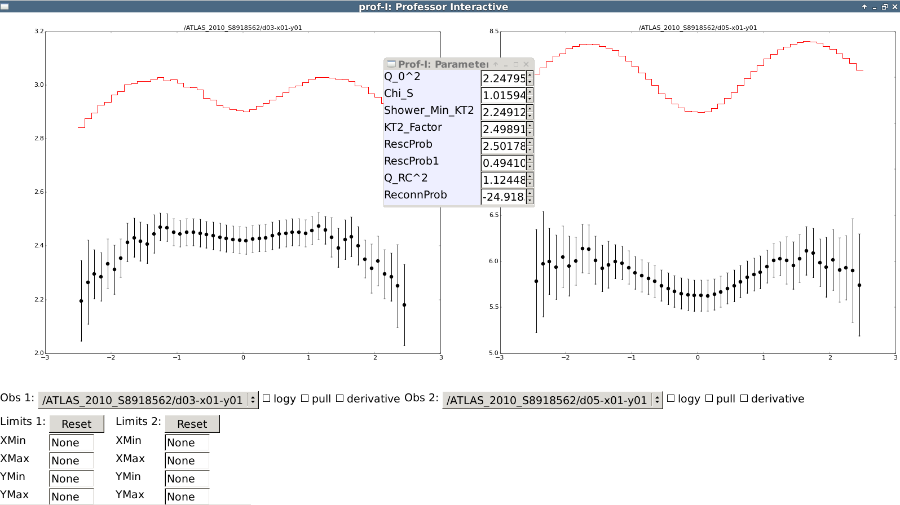

prof2-I
=======

.. note::

    This script requires :code:`matplotlib` and :code:`wxWindows`.

Interactive parametrisation explorer

::

  prof2-I  IPOLFILE  <options>

Or, to also draw data:

::

  prof2-I  IPOLFILE  DATADIR  <options>

Options::

  --wfile # Specify a weight file to limit plotting to a subset of observables

Example:

* The red line is the parametrisation for a parameter point set with the dials in the second window
* Optionally, data can be plotted
* The histograms to be shown can be selected from the drop-down menu

