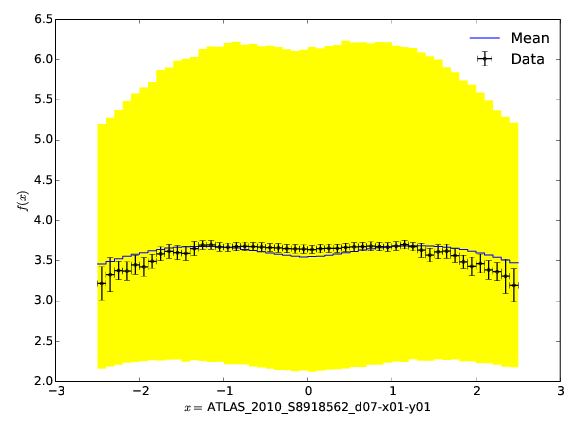

prof2-envelopes
===============

Produce envelope plots. Requires :code:`matplotlib`.

::

    prof2-envelopes  RUNDIR  <options>

or, to add corresponding data points:

::

    prof2-envelopes  RUNDIR  DATADIR  <options>

:code:`RUNDIR` must point to the top level directory that contains all the MC runs (main directory created with :file:`prof2-sample`).
:code:`DATADIR` optional command line argument that should point to a directory containing corresponding data points

Options::

  -o      # Specify output folder
  --wfile # Specify a weight file to limit plotting to a subset of observables

Example:

* The envelope (yellow) is constructed from all valid mc runs in :code:`RUNDIR`
* The mean of the envelope is drawn in blue
* The (optional) data is shown as errorbars

