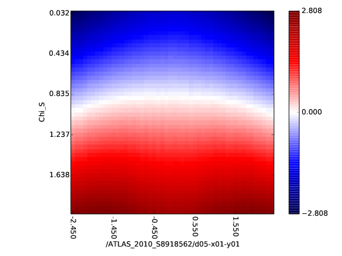

prof2-sens
==========

Sensitivity plots based on gradients. Requires :code:`matplotlib`.

::

    prof2-sens  IPOLFILE  <options>

:code:`IPOLFILE` must point to a parametrisation file (output file of :file:`prof2-ipol`).
    
Options::

  -o      # Specify output folder
  --wfile # Specify a weight file to limit plotting to a subset of observables

Example:

* x-axis: bins of a histogram
* y-axis: a parameter axis
* z-axis: in color coding the derivative of each bin at the y-axis coordinate

